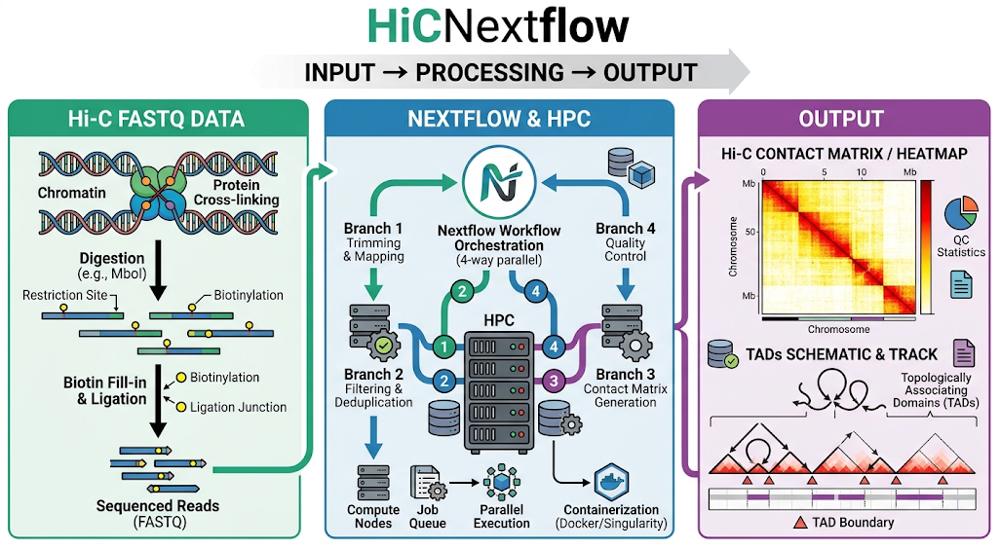
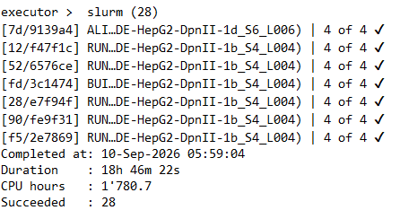
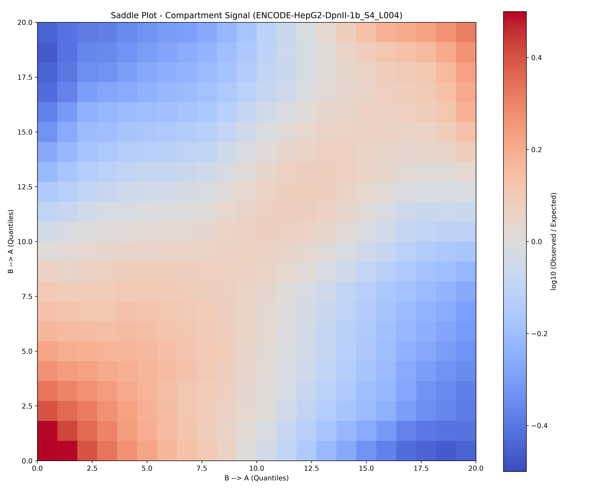
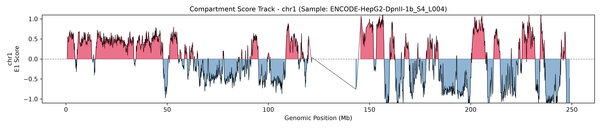

<!--  -->

A high-performance, reproducible, and containerized pipeline for Hi-C data preprocessing and 3D genomic feature analysis built with **Nextflow DSL2**, **Singularity**, and **Docker**.

---

## 📐 Pipeline Workflow Architecture

The pipeline processes raw paired-end FASTQ reads into contact matrices, multi-resolution balanced Cooler files, A/B compartments, Topologically Associating Domains (TADs), and chromatin loops.

```text
FASTQ (Paired-end)
  │
  ▼
[ ALIGN_BWA ] ──> bwa-mem2 alignment (Output: Name-sorted BAM)
  │
  ▼
[ RUN_PAIRTOOLS ] ──> Hi-C pairs parsing, sorting, deduplication & filtering (.valid.pairs.gz)
  │
  ├───► [ BUILD_COOLER ] ──> cooler cload (10 kb) ──► cooler zoomify (.mcool)
  │         │
  │         ▼
  │     [ RUN_COMPARTMENTS ] ──> cooltools A/B compartment analysis (E1 eigenvector)
  │
  └───► [ RUN_JUICER_PRE ] ──> Juicer Tools pre (.hic matrix generation)
            │
            ├───► [ RUN_ARROWHEAD ] (Parallel task) ──► TAD Calling (CPU)
            │
            └───► [ RUN_HICCUPS ]   (Parallel task) ──► Chromatin Loop Calling (★ Requires GPU)
```

---

## 🧩 Pipeline Design & Module Details (`main.nf`)

The workflow is implemented using **Nextflow DSL2** with modularity and resource optimization across key execution steps:

### 1. `ALIGN_BWA`
- **Tool**: `bwa-mem2 mem -5SP`
- **Function**: Optimized paired-end alignment specifically tuned for 5' chimeric Hi-C reads.
- **Optimization**: Dynamically allocates threads between `bwa-mem2` and `samtools sort -n` to directly produce name-sorted BAM files, minimizing disk I/O.
- **Reference Passing**: The reference genome FASTA path is passed as a string (`val fasta`) to ensure `bwa-mem2` has direct access to index files (`.bwt`, `.pac`, `.ann`, etc.) in the database directory without missing symlinks.

### 2. `RUN_PAIRTOOLS`
- **Tools**: `pairtools parse`, `pairtools sort`, `pairtools dedup`, `pairtools select`
- **Function**: Parses alignments into Hi-C contact pairs (`--walks-policy 5unique`), sorts pairs, marks PCR duplicates, and filters for high-quality valid contacts (`UU`, `UR`, `RU`).
- **Output**: Generates `.valid.pairs.gz` and duplicate statistics (`.dedup.stats`).

### 3. `BUILD_COOLER` & `RUN_COMPARTMENTS`
- **Tools**: `cooler`, `cooltools`, `bioframe`
- **Matrix Generation**:
  - `cooler cload`: Builds the base resolution contact matrix (default: `10 kb`).
  - `cooler zoomify`: Generates multi-resolution contact maps (`10kb`, `20kb`, `50kb`, `100kb`, `250kb`, `500kb`, `1Mb`) with Knight-Ruiz (KR) / iterative correction matrix balancing.
- **Compartment Analysis**:
  - Calculates GC fraction across genomic bins using `bioframe`.
  - Performs eigenvector decomposition (`cooltools.eigs_cis`) at `100 kb` resolution to produce A/B compartment profiles (`.compartments.bedgraph`).

### 4. `RUN_JUICER_PRE`, `RUN_ARROWHEAD`, `RUN_HICCUPS`
- **Tool**: `Juicer Tools` (`juicer_tools.jar`)
- **Matrix Generation (`RUN_JUICER_PRE`)**: Converts valid pairs into `.hic` format.
- **Parallel Feature Calling**:
  - **`RUN_ARROWHEAD`**: Identifies Topologically Associating Domains (TADs) using matrix transformation and corner-score metrics (CPU-bound).
  - **`RUN_HICCUPS`**: Detects focal chromatin loops using GPU acceleration.

---

## ⚙️ Execution Profiles & Resource Management (`nextflow.config`)

The pipeline includes preset execution profiles tailored for local workstations and HPC clusters:

| Profile | Target Environment | Container Engine | GPU Acceleration (`HiCCUPS`) |
| :--- | :--- | :--- | :--- |
| `local` | Standalone Linux Workstation | Singularity | `--nv` flag |
| `local_docker` | Local Docker Host | Docker | `--gpus all` |
| `hpc_slurm` | High-Performance Computing (Slurm) | Singularity | `--gres=gpu:1`, `--nv` |

### Detailed Resource Allocations (`hpc_slurm` profile)

| Process | Core Function | CPUs | Memory | Time Limit | Notes |
| :--- | :--- | :--- | :--- | :--- | :--- |
| `ALIGN_BWA` | Read Alignment | 32 | 90 GB | 24h | High CPU compute |
| `RUN_PAIRTOOLS` | Pairs Parsing & Dedup | 24 | 60 GB | 12h | Multi-threaded disk I/O |
| `BUILD_COOLER` | Multi-res Matrix (.mcool) | 16 | 60 GB | 8h | Multi-resolution zoomify |
| `RUN_COMPARTMENTS` | A/B Compartment Calling | 16 | 32 GB | 4h | `cooltools` eigenvector analysis |
| `RUN_JUICER_PRE` | `.hic` File Construction | 16 | 200 GB | 12h | Memory-intensive sorting |
| `RUN_ARROWHEAD` | TAD Detection | 8 | 32 GB | 6h | Matrix computation |
| `RUN_HICCUPS` | Chromatin Loop Detection | 8 | 48 GB | 8h | Requires 1x NVIDIA GPU |

---

## 🚀 Quick Start & Use Case

### Prerequisites
- **Nextflow**: Version 22.10+ (requires Java 11+ or Java 17)
- **Container Engine**: Singularity (Apptainer) or Docker

### Data

The benchmark and use case evaluation utilize public deep-sequencing datasets from the 4DN Data Portal:

| 4DN Portal | number of Spots | number of Bases |
| :--- | ---: | :--- |
| ENCODE-HepG2-DpnII-1a_S3_L003 | 336,457,191 | 33.6G |
| ENCODE-HepG2-DpnII-1b_S4_L004 | 345,293,363 | 34.5G |
| ENCODE-HepG2-DpnII-1c_S5_L005 | 261,439,954 | 26.1G |
| ENCODE-HepG2-DpnII-1d_S6_L006 | 350,114,863 | 35.0G |

### Running the Workflow

Execute with Slurm profile:
```bash
nextflow run main.nf \
    -profile hpc_slurm \
    --fastq_dir "/path/to/NGS_DATA/HiC" \
    --reads "/path/to/NGS_DATA/HiC/*_R{1,2}_001.fastq.gz" \
    --fasta "/path/to/reference_FASTA/Homo_sapiens_assembly38.fasta" \
    --chrom_sizes "/path/to/reference_FASTA/chrom.sizes" \
    --outdir "/path/to/output" \
    -resume
```

> **Tip**: Always provide `-resume` to leverage Nextflow's pipeline caching mechanism, allowing interrupted runs to continue without re-executing completed tasks.

### Pipeline Execution Outputs

Below are representative results demonstrating a successful end-to-end run across the dataset:

#### 1. Execution Summary & Resource Runtime

*Real-time trace confirming successful Slurm task completion (28/28 tasks succeeded across 4 parallel branches) with full pipeline duration and cumulative compute resource tracking.*

#### 2. Saddle Plot (Compartment Interaction Frequency)

*Saddle plot illustrating genome-wide compartmentalization strength and preferential contact frequencies between A-A and B-B compartments relative to expected interactions.*

#### 3. A/B Compartment Eigenvector Track (chr1)

*First eigenvector (E1 score) track across chromosome 1 at 100 kb resolution, delineating active open chromatin (Compartment A, red) and inactive closed heterochromatin (Compartment B, blue).*

---

## 📚 References

- Kruse, Kai, Clemens B. Hug, and Juan M. Vaquerizas. "FAN-C: a feature-rich framework for the analysis and visualisation of chromosome conformation capture data." *Genome biology* 21.1 (2020): 303.
- Di Tommaso, P., Chatzou, M., Floden, E. W., Barja, P. P., Palumbo, E., & Notredame, C. (2017). Nextflow enables reproducible computational workflows. *Nature biotechnology*, 35(4), 316-319.
- Neva C. Durand, James T. Robinson, Muhammad S. Shamim, Ido Machol, Jill P. Mesirov, Eric S. Lander, and Erez Lieberman Aiden. "Juicebox provides a visualization system for Hi-C contact maps with unlimited zoom." *Cell Systems* 3(1), 2016.
